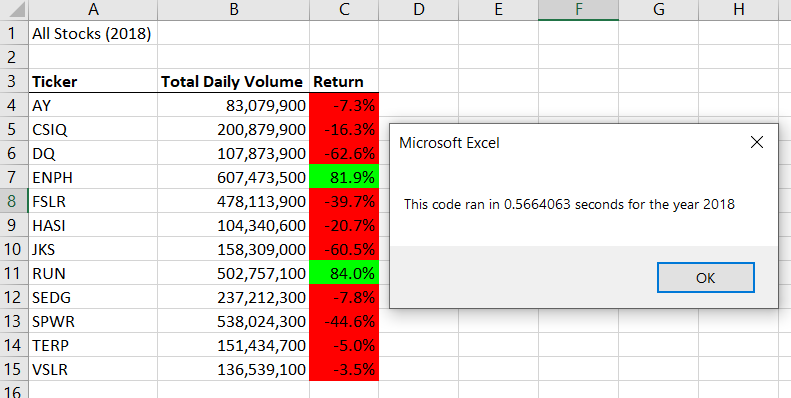

# Wall Street VBA Analysis

## *Purpose*

The purpose of this project is to analyze stock data for green energy companies in 2017 and 2018.  We calculate both the sum of the total daily volumes for each year and the annual return for each ticker symbol.

## *Results*

Overall, these green energy stocks performed much better in 2017 than 2018 with the exception of TerraForm Power (ticker symbol TERP) as you can see from the data below.




The refactored scrips ran the subroutines in 0.55 s and 0.57 s for the years 2017 and 2018 respectively.  This is a marginal improvement on 0.64 s and 0.67 s for the original script, screenshots are provided below.


### *How do the macros differ?*

The major difference in the two methods used to produce the same data is the data storage method.  In the original subroutine, cells in the worksheet are updated with each iteration of a for loop, similar to the below code.
```
For i in tickers

...

    Worksheets("AllStocksAnalysis").Activate
    Cells(4 + i, 1).Value = ticker
    Cells(4 + i, 2).Value = totalVolume
    Cells(4 + i, 3).Value = endingPrice / startingPrice - 1

...

End i
```

The script for the refactored method stores the loop output data in three data arrays, which are then used to update the worksheet with the data after the data acquisition loops have ran, similar to the below code.

```
Dim tickerVolumes(12) As Long
Dim tickerStartingPrices(12) As Single
Dim tickerEndingPrices(12) As Single

'For loops populating arrays

For i = 0 To 11
        
    Worksheets("All Stocks Analysis").Activate
        
    Cells(4 + i, 1).Value = tickers(i)
    Cells(4 + i, 2).Value = tickerVolumes(i)
    Cells(4 + i, 3).Value = tickerEndingPrices(i) / tickerStartingPrices(i) - 1

End i

```

This manipulation may seem trivial, but it did cut roughly a tenth of a second off of the run time for each subroutine.